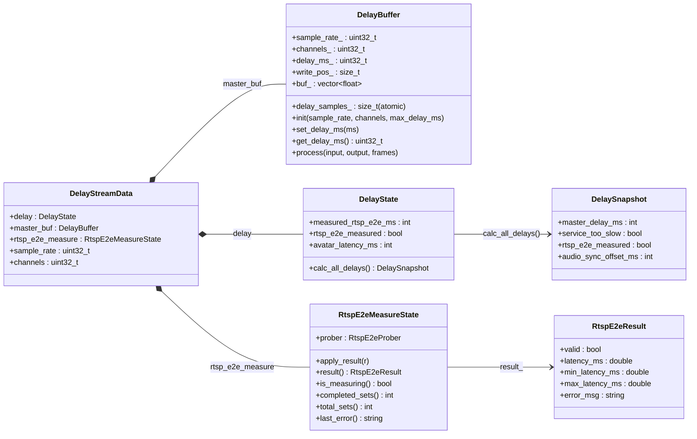

# src の時間関連主要データ構造（UML）

`src` 配下で「時間（delay / latency）」を扱う主要なデータ構造を mermaid の `classDiagram` で整理したもの。



## 補足

- `DelayStreamData` がランタイム中の設定値（`avatar_latency_ms`, `measured_rtsp_e2e_ms`）と各機能（`RtspE2eMeasureState`）を集約する。
- 実際の音声遅延適用は `DelayBuffer`（`master_buf`）で行われる。
- 計測値は `RtspE2eMeasureState` → `RtspE2eResult` に保持される。

## ディレイ計算式

`calc_all_delays()` で実行する。

```
R = measured_rtsp_e2e_ms   (RTSP E2E 計測結果)
A = avatar_latency_ms      (想定アバター遅延)

service_too_slow = rtsp_e2e_measured && (R > A)
master_delay_ms  = service_too_slow ? 0 : max(0, A - R)
```

`service_too_slow` が真のときはディレイ調整不能（配信遅延 R が想定アバター遅延 A を超えている）。
この場合は UI でエラーを表示し、より低遅延な配信サービスへの切り替えを促す。
