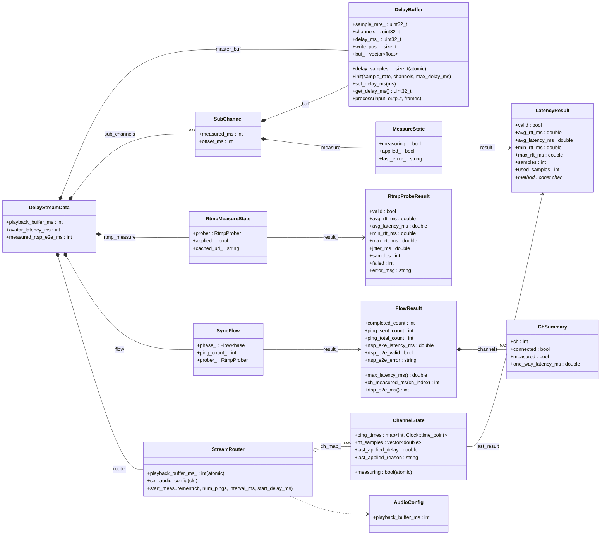

# src の時間関連主要データ構造（UML）

`src` 配下で「時間（delay / latency / RTT / playback buffer）」を扱う主要なデータ構造を、
mermaid の `classDiagram` で整理したものです。



## 補足

- `DelayStreamData` がランタイム中の設定値（`avatar_latency_ms`, `measured_rtsp_e2e_ms`, `playback_buffer_ms`）と、各機能（`SyncFlow`, `StreamRouter`, `RtmpMeasureState`）を集約します。
- 実際の音声遅延適用は `DelayBuffer`（`master_buf` と各 `SubChannel::buf`）で行われます。
- 計測値は WebSocket 側が `LatencyResult`（チャンネル別）、RTSP E2E 側が `RtspE2eResult`、全体集約が `FlowResult` です。

## 遅延計算式

`recalc_all_delays()` で全チャンネル一括実行します。

```
R = measured_rtsp_e2e_ms      (RTSP E2E 計測結果)
A = avatar_latency_ms         (アバターレイテンシ)
B = playback_buffer_ms        (再生バッファ量)
C[i] = sub_channels[i].measured_ms  (チャンネル i の WS 計測結果)
offset[i] = sub_channels[i].offset_ms  (チャンネル i の手動補正)

raw[i]   = R - A - C[i] - B - offset[i]
neg_max  = max(0, max(-raw[i] for all measured i where raw[i] < 0))

ch_delay[i] = raw[i] + neg_max   (各チャンネルの DelayBuffer 適用値)
obs_delay   = neg_max             (OBS オーディオ出力の DelayBuffer 適用値)
```

### ローカル生演奏 (`live_perf_enabled`) が成立する場合の補正

> 目的・設計判断・運用上の注意は [live-performance.md](live-performance.md) を参照。

配信者がソース音源をリアルタイムにモニターしながら演奏するケース。プラグイン挿入
チャンネルへは配信チャンネルより `lead_time_ms` だけ先行して音を入力する前提で、調整
できないローカル聴取タイミングに全体を揃える。

```
min_lead     = neg_max + R - A             (成立に必要な最小先行時間)
live_extra   = lead_time_ms - min_lead     (成立時は >= 0)

ch_delay[i] += live_extra                  (計測済み/仮値チャンネルのみ)
master_delay = neg_max + live_extra        (タイミング図・案内用に保持する値)
obs_delay    = 0                           (本線 master_buf へは適用しない)
```

- プラグイン挿入チャンネルは配信に乗らない前提のため、本線(`master_buf`)へは自動調整
  ディレイを適用せず、配信チャンネル側へ設定すべき同期オフセット値をUIで案内する。
- 成立条件: `R <= A`（超過は解決不能 = Error）かつ `lead_time_ms >= min_lead`
  （不足は最小値を案内 = Warning）。いずれか不成立なら `live_extra` は適用しない。
